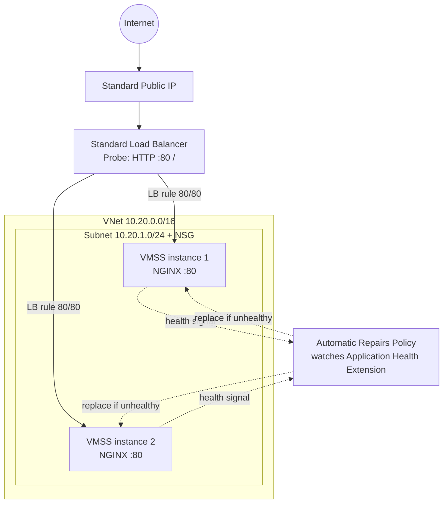

# Auto-Healing Web Tier — Azure + Bicep

A minimal, self-healing web tier on Azure: any single VM can be terminated and the
platform replaces it automatically, with zero manual intervention and zero downtime
for the site as a whole (the other instance keeps serving while the replacement boots).

## Why Azure + Bicep

- **Bicep over Terraform/CloudFormation**: it's Azure-native (no provider/state-file
  management), compiles down to ARM (so `what-if` gives a true, no-side-effect plan
  diff for free), and keeps the whole exercise to plain `az` CLI commands with no
  extra state backend to stand up.
- **VM Scale Set (VMSS) over paired standalone VMs**: VMSS is the Azure primitive that
  ties together "replace an unhealthy instance" and "spread load across N+1
  instances" in one resource, instead of hand-rolling that logic with Availability
  Sets + a separate watcher.

## Architecture



**How self-healing actually works here:** each instance runs the
`ApplicationHealthLinux` extension, which polls `http://localhost:80/` and reports
Healthy/Unhealthy to the platform. The VMSS `automaticRepairsPolicy` watches that
signal; if an instance is deleted, stopped, or its health check fails for the grace
period (10 minutes), the scale set automatically deletes and recreates it from the
same model — no human, no script, no pipeline needed. This is distinct from (and
layered on top of) simple autoscale.

## Repository layout

```
infra/
  main.bicep              # orchestrates the three modules, exposes outputs
  main.bicepparam          # default parameter values (no secrets committed)
  modules/
    network.bicep          # VNet, subnet, NSG (80/443 open, SSH restrictable)
    loadbalancer.bicep      # Standard LB: frontend IP, probe, rule, outbound rule
    vmss.bicep               # VMSS + health extension + automatic repairs
cloud-init/
  nginx-default.yaml       # default: apt-installs NGINX (must-have #4)
  docker-ghcr.yaml          # bonus: pulls & runs the container from GHCR
app/
  Dockerfile                # bonus: containerises the same static page
  index.html
.github/workflows/
  bicep-validate.yml        # lint + build + optional what-if (plan-only)
  docker-publish.yml         # bonus: builds & pushes image to GHCR
```

**Naming/tagging convention:** every resource is named `<namePrefix>-<type>`
(e.g. `shweb-vmss`, `shweb-lb`, `shweb-nsg`) and carries the same four tags
(`project`, `environment`, `managedBy`, `owner`) applied centrally in `main.bicep`,
so cost and resources can be filtered consistently regardless of who deploys.

## Prerequisites

- [Azure CLI](https://learn.microsoft.com/cli/azure/install-azure-cli) (includes Bicep support via `az bicep install`)
- An Azure subscription and `az login`
- An SSH key pair (`ssh-keygen -t ed25519`) — only the public key is ever passed in

## Region availability

`australiaeast` is the default in `infra/main.bicepparam`, but restricted subscription
types (e.g. **Azure for Students**, some free trials) are limited by an Azure Policy
("Allowed resource deployment regions") to a small, account-specific set of regions
that may not include it. If `what-if`/`create` fails with `RequestDisallowedByAzure`,
check your allowed regions (Portal → **Policy → Assignments** → the "Allowed
resource deployment regions" assignment → **Parameters** tab, or
`az policy assignment list -o table` via CLI) and override the location, e.g.:

```bash
az deployment group what-if -g rg-self-healing-web -f infra/main.bicep \
  -p infra/main.bicepparam -p location=eastus \
  -p sshPublicKey="$(cat ~/.ssh/shweb_key.pub)"
```

`-p location=<region>` on the command line overrides the value in the params file
without editing it, which is the cleanest way to handle this per-reviewer.

## Running a plan (no resources created)

```bash
az group create -n rg-self-healing-web -l australiaeast   # only if the RG doesn't exist yet

az deployment group what-if \
  -g rg-self-healing-web \
  -f infra/main.bicep \
  -p infra/main.bicepparam \
  -p sshPublicKey="$(cat ~/.ssh/id_ed25519.pub)"
```

`what-if` is Bicep/ARM's equivalent of `terraform plan`: it shows exactly what would
be created/changed without touching the subscription. As noted in the brief,
provisioning is optional — this repo has only been validated with `bicep build`
and `what-if`, not a live `apply`.

## Applying (optional)

```bash
az deployment group create \
  -g rg-self-healing-web \
  -f infra/main.bicep \
  -p infra/main.bicepparam \
  -p sshPublicKey="$(cat ~/.ssh/id_ed25519.pub)"
```

Re-running the exact same command a second time is a no-op (Bicep/ARM deployments
are declarative — matching an unchanged desired state produces "no changes" on
`what-if`), satisfying the self-provisioning requirement.

**To prove self-healing after a real apply:**
```bash
az vmss list-instances -g rg-self-healing-web -n shweb-vmss -o table
az vmss delete-instances -g rg-self-healing-web -n shweb-vmss --instance-ids <id>
# watch a replacement instance appear automatically:
watch az vmss list-instances -g rg-self-healing-web -n shweb-vmss -o table
```

## Bonus: containerised variant

1. `app/Dockerfile` builds `nginx:alpine` + the static page.
2. `.github/workflows/docker-publish.yml` builds and pushes it to
   `ghcr.io/<owner>/<repo>:latest` on every push to `app/**` (free, public registry).
3. To use it instead of the plain-NGINX bootstrap, point `main.bicep` at the other
   cloud-init file:
   ```bicep
   var customData = base64(loadTextContent('../cloud-init/docker-ghcr.yaml'))
   ```
   and fill in your GHCR owner/image name in `cloud-init/docker-ghcr.yaml`.

## Assumptions

- Region: `australiaeast`. No other region-specific behaviour assumed.
- Ubuntu 24.04 LTS as the base image (smallest supported footprint for a static page).
- SSH is left open to `Internet` by default via the `sshSourceCidr` parameter purely
  so the plan is reviewable without knowing the reviewer's IP; in real use this
  should be locked to a specific CIDR (or removed and Azure Bastion used instead).
- No custom domain/TLS — the LB serves plain HTTP on the public IP, matching the
  "default NGINX welcome page" scope.
- A **Standard** Load Balancer is used because Basic Load Balancer was retired by
  Microsoft (Sept 2025); Standard is now the only supported SKU, which affects the
  cost estimate below.
- No autoscale-by-metric rules — capacity is fixed at N+1 (2) since the brief asks
  for "at least two instances," not elastic scaling.

## Estimated monthly cost (AUD, `australiaeast`, pay-as-you-go, if fully deployed 24/7)

| Resource | Est. USD/mo | Est. AUD/mo* |
|---|---|---|
| 2× `Standard_B1s` VM | ~$7.60 each → ~$15.20 | ~$23 |
| Standard Load Balancer (base + rule) | ~$18.25 | ~$27 |
| Standard Public IP (static) | ~$3.65 | ~$5.50 |
| 2× 30 GB Standard SSD OS disks | ~$3.20 | ~$5 |
| **Total (24/7)** | **~$40** | **~$60** |

\*Converted at an approximate 1 USD ≈ 1.50 AUD rate; actual pricing varies by exact
region/time and should be confirmed in the [Azure Pricing Calculator](https://azure.microsoft.com/pricing/calculator/).

**This exceeds the AUD 20/month target if left running continuously — flagged
honestly rather than hidden.** The Standard Load Balancer's fixed base charge is
the dominant cost driver (Basic LB, which was free, is no longer available). Ways
to bring this under budget that weren't applied by default (to keep the template
simple and reviewable) but are straightforward follow-ups:
- Downsize to `Standard_B1ls` (~half the VM cost).
- Use an **auto-shutdown schedule** or deallocate the scale set outside test windows
  — since this exercise is plan-only, actual spend during review is effectively $0.
- Use Azure Dev/Test pricing if this were run under a Dev/Test subscription.

## Pipeline

`.github/workflows/bicep-validate.yml` runs `az bicep build` (lint/type-check) on
every PR touching `infra/**`, and — only if Azure OIDC secrets/vars are configured
on the repo — an additional `what-if` plan-only step. It intentionally never runs
`deployment group create`, matching the "plan-only is sufficient" note in the brief.
